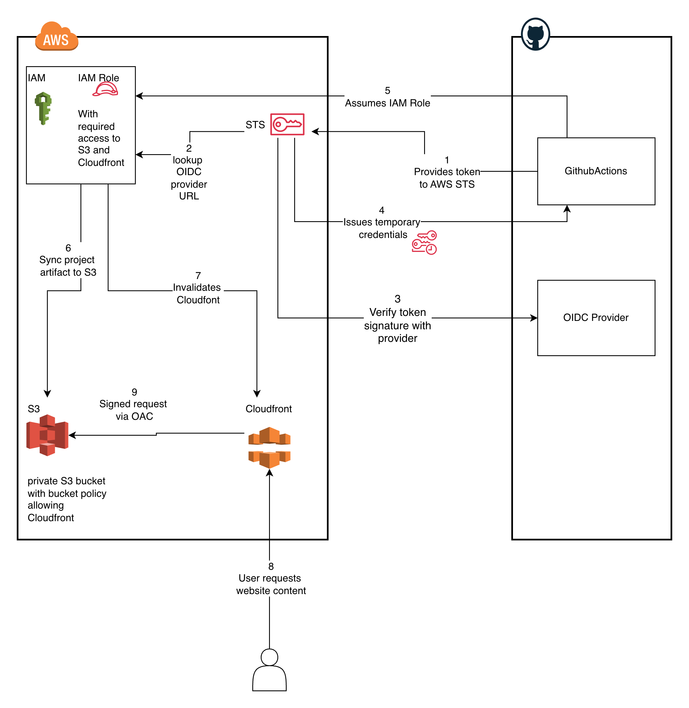

# A.IFANIYI Portfolio


A responsive, accessible portfolio website built with React, TypeScript, and Vite. Features a dark/light theme, 3D project carousel, animated sections, and automatic deployment to AWS via GitHub Actions.

🌐 **Live site**: [visit the site](https://d1vrdtnb8uq02n.cloudfront.net)

## Tech Stack

- **Framework** — React 18 with TypeScript
- **Build tool** — Vite
- **Styling** — Tailwind CSS
- **UI components** — shadcn/ui (Radix UI primitives)
- **Routing** — React Router v6
- **Icons** — Lucide React

## Getting Started

### Prerequisites

- Node.js 18+
- npm

### Installation

```bash
git clone https://github.com/aifaniyi/portfolio.git
cd portfolio
npm install
```

### Development

```bash
npm run dev
```

### Available Scripts

| Script | Description |
|---|---|
| `npm run dev` | Start local dev server |
| `npm run build` | Type-check and build for production |
| `npm run preview` | Preview the production build locally |
| `npm run lint` | Run ESLint |

## Project Structure

```
src/
├── components/       # UI components
│   └── ui/           # shadcn/ui primitives
├── data/             # Portfolio content (projects, skills, personal info)
├── hooks/            # Custom React hooks
├── lib/              # Utility functions
├── pages/            # Route-level pages
├── styles/           # Global CSS
└── types/            # TypeScript types
```

## Deployment



The site is hosted on a private S3 bucket served through CloudFront using Origin Access Control (OAC). The S3 bucket is never exposed to the internet — only CloudFront can read from it. GitHub Actions handles CI/CD using OIDC to authenticate with AWS without storing any long-lived credentials.

### Prerequisites

- AWS account with permissions to manage IAM, S3, and CloudFront
- Terraform >= 1.6
- AWS CLI configured locally

### 1. Provision infrastructure

```bash
cd terraform
cp terraform.tfvars.example terraform.tfvars
# edit terraform.tfvars with your bucket name, GitHub username, and region

terraform init
terraform apply
```

See [`terraform/`](./terraform) for full details on the resources created.

### 2. Configure GitHub Actions secrets

In your GitHub repository go to **Settings → Secrets and variables → Actions** and add:

| Secret | Value |
|---|---|
| `AWS_ROLE_ARN` | `github_actions_role_arn` Terraform output |
| `S3_BUCKET_NAME` | `s3_bucket_name` Terraform output |
| `CLOUDFRONT_DISTRIBUTION_ID` | `cloudfront_distribution_id` Terraform output |
| `AWS_REGION` | The region you deployed to (e.g. `us-east-1`) |

### 3. Deploy

Push to `main` — the [workflow](.github/workflows/deploy.yml) will lint, build, sync assets to S3, and invalidate the CloudFront cache automatically. Pull requests run the build and lint steps only, without deploying.

## License

[MIT](./LICENSE)
